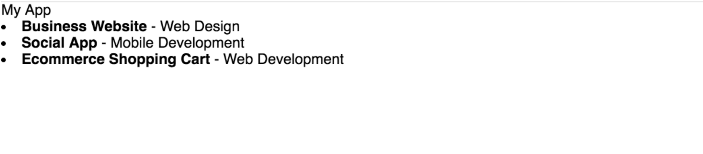

<h1> Simple React Project </h1>

Goal is to make a simple management app to host projects and todos

<ul>
  <li>
    <h4>Progress</h4>
    <ul>
      <li>
        <h5>Implemented project components, added Pseudo projects</h5>
        
      </li>
      <li>
        <h5>Printed Hello World</h5>
        
      </li>
    </ul>
  </li>
</ul>
<!--  -->
